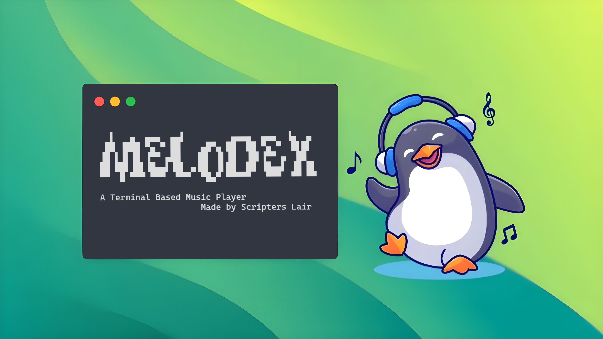

# Melodex

> [!WARNING]
> - WIP

<h2>Overview</h2>

  
Information

 
Melodex is a local, lightweight CLI music player. A Go application using the Bubbletea Libary. It is usable on Unix based operating systems
 

  
Maintainers

  
- **Lead Developer**: [OhSystemmm](https://github.com/ohSystemmm)
- **Contributer**: [Y2kun](https://github.com/Y2kun)
- **Contributer**: [NvmChris](https://github.com/nvmChris)

  
Help

If you encounter any issues with the application and believe it to be related to the application itself, please feel free to reach out or open an issue. ohSystemmm@gmail.com 

<h2>Demonstration</h2>

<h2>Links</h2>

  
<a href="Using.md">Using</a>

  
<a href="CODE_OF_CONDUCT.md">Code of Conduct</a>

  
<a href="LICENSE.md">License</a>

  
<a href="SECURITY.md">Security</a>

 

